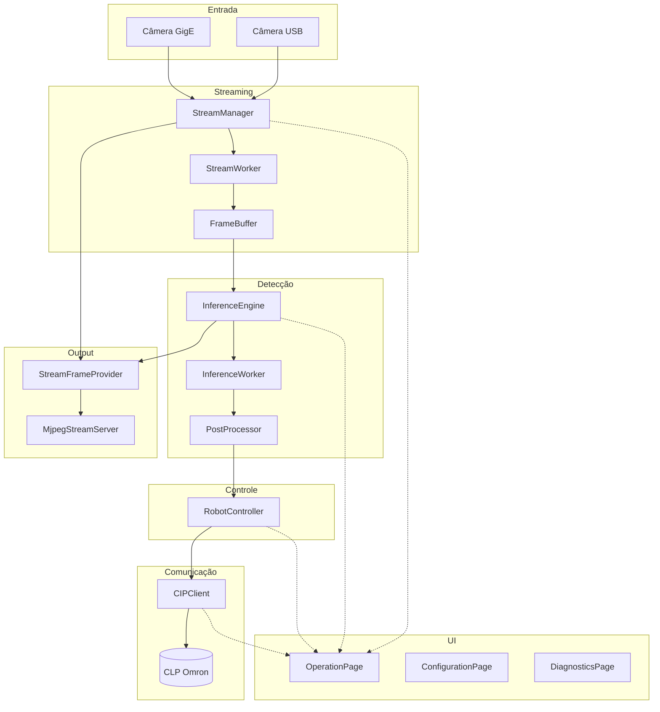
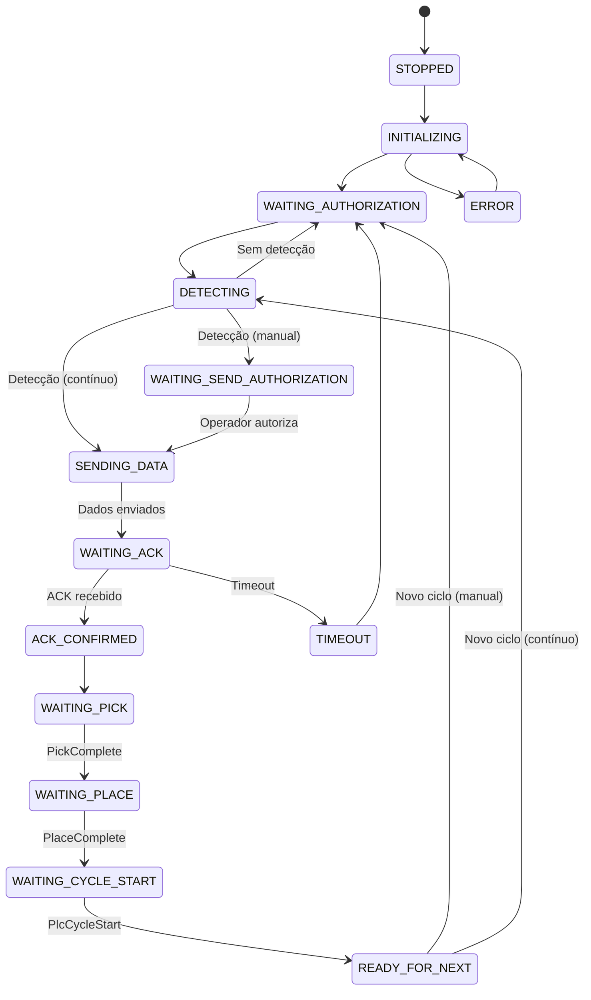
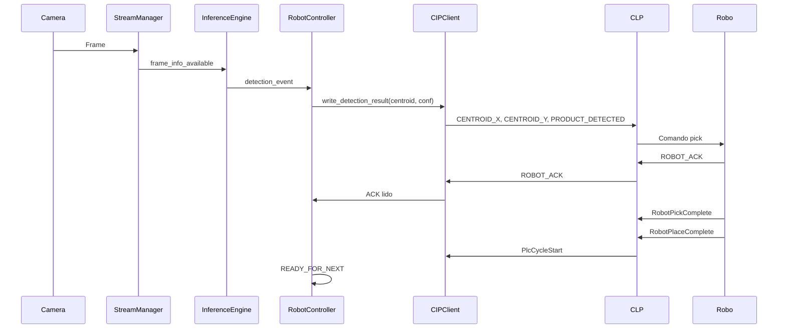

# Documentação Completa — Buddmeyer Vision System v2.0

**Visão de alto e baixo nível** — Arquitetura, features, variáveis, classes, funções, diagramas, casos de uso e UI.

> **Documento complementar:** `DOCUMENTACAO_COMPLETA.md` — features por código, manual de manutenção e estrutura de diretórios detalhada.

---

## Índice

1. [Documentação de Alto Nível](#1-documentação-de-alto-nível)
2. [Features por Código e Mapa de Funções](#2-features-por-código-e-mapa-de-funções)
3. [Diagramas](#3-diagramas)
4. [Casos de Uso](#4-casos-de-uso)
5. [Documentação de Baixo Nível](#5-documentação-de-baixo-nível)
6. [UI — Interface do Usuário](#6-ui--interface-do-usuário)
7. [Variáveis Globais e por Feature](#7-variáveis-globais-e-por-feature)

---

# 1. Documentação de Alto Nível

## 1.1 Objetivo do Sistema

Sistema **supervisório** para automação de **pick-and-place** industrial:

- **Visão computacional**: detecção em tempo real de embalagens (RT-DETR/DETR)
- **Comunicação**: CLP Omron NX102 via CIP/EtherNet-IP
- **Função**: coordenadas do centroide → CLP → robô executa pick → place

## 1.2 Fluxo de Dados

```
Fonte (USB ou GigE)
    → StreamManager (StreamWorker QThread)
    → FrameBuffer
    → InferenceEngine (InferenceWorker QThread)
    → PostProcessor (NMS, threshold)
    → DetectionEvent
    → RobotController (máquina de estados)
    → CIPClient → CLP (TAGs: centroide, confiança, ACK, pick/place)
    → UI (VideoWidget, StatusPanel, EventConsole) via Signals
```

**Stream MJPEG (supervisório web):** frames anotados → `StreamFrameProvider` → `MjpegStreamServer` → `GET /stream`.

## 1.3 Features Principais

| Feature | Descrição | Módulos |
|---------|-----------|---------|
| **Aquisição de vídeo** | 2 fontes: câmera USB, câmera GigE | `streaming/` |
| **Detecção de objetos** | RT-DETR, filtros, NMS | `detection/` |
| **Calibração mm/px** | Conversão de coordenadas pixel → mm | `preprocessing.transforms`, config |
| **Comunicação CLP** | Leitura/escrita de TAGs, handshake | `communication/` |
| **Ciclo pick-and-place** | Máquina de estados, modo manual/contínuo | `control/` |
| **Stream web** | MJPEG para supervisório remoto | `output/` |
| **Interface** | 3 abas: Operação, Configuração, Diagnósticos | `ui/` |

## 1.4 Glossário Rápido

| Termo | Significado |
|-------|-------------|
| **CLP** | Controlador Lógico Programável (Omron NX102) |
| **CIP** | Protocolo Common Industrial Protocol (EtherNet-IP) |
| **TAG** | Variável lógica no CLP (ex.: CENTROID_X, ROBOT_ACK) |
| **Handshake** | Sequência de sinais entre visão e CLP para sincronizar ciclo |
| **NMS** | Non-Maximum Suppression (filtro de caixas sobrepostas) |
| **mm/px** | Calibração: milímetros por pixel para coordenadas físicas |

---

# 2. Features por Código e Mapa de Funções

## 2.1 Features por Código — Tabela de Mapeamento

| Feature | Arquivo(s) | Classes/Funções principais |
|---------|------------|----------------------------|
| **Ponto de entrada** | `main.py` | `main()`, `setup_environment()` |
| **Configuração** | `config/settings.py` | `Settings`, `StreamingSettings`, `get_settings()` |
| **Fonte USB** | `streaming/source_adapters.py` | `USBCameraAdapter`, `create_adapter()` |
| **Fonte GigE** | `streaming/source_adapters.py` | `GigECameraAdapter`, `create_adapter()` |
| **Stream/captura** | `streaming/stream_manager.py` | `StreamManager`, `StreamWorker`, `start()`, `stop()` |
| **Buffer de frames** | `streaming/frame_buffer.py` | `FrameBuffer`, `FrameInfo` |
| **Carregamento do modelo** | `detection/model_loader.py` | `ModelLoader.load()` |
| **Inferência** | `detection/inference_engine.py` | `InferenceEngine`, `InferenceWorker`, `process_frame()` |
| **Pós-processamento** | `detection/postprocess.py` | `PostProcessor.process()`, `_nms()` |
| **Eventos de detecção** | `detection/events.py` | `DetectionEvent`, `DetectionResult`, `from_result()` |
| **Calibração mm/px** | `preprocessing/transforms.py` | `pixel_to_mm()` |
| **Conexão CIP** | `communication/cip_client.py` | `CIPClient`, `connect()`, `write_detection_result()` |
| **Ciclo robô** | `control/robot_controller.py` | `RobotController`, `process_detection()`, `_transition_to()` |
| **Stream MJPEG** | `output/mjpeg_stream.py` | `StreamFrameProvider`, `MjpegStreamServer` |
| **Janela principal** | `ui/main_window.py` | `MainWindow` |
| **Aba Operação** | `ui/pages/operation_page.py` | `OperationPage`, `_start_system()`, `_stop_system()` |
| **Aba Configuração** | `ui/pages/configuration_page.py` | `ConfigurationPage`, `_save_settings()` |
| **Aba Diagnósticos** | `ui/pages/diagnostics_page.py` | `DiagnosticsPage` |
| **Widget de vídeo** | `ui/widgets/video_widget.py` | `VideoWidget`, `update_frame()`, `update_detections()` |
| **Painel de status** | `ui/widgets/status_panel.py` | `StatusPanel`, `set_connection_state()` |
| **Logging** | `core/logger.py` | `setup_logging()`, `get_logger()` |
| **Métricas** | `core/metrics.py` | `MetricsCollector`, `record()` |

## 2.2 Funções do Sistema → Arquivo/Código

### Entrada e Configuração

| Função/Método | Arquivo | Responsabilidade |
|---------------|---------|------------------|
| `main()` | `main.py` | Inicializa app, carrega config, exibe janela |
| `get_settings()` | `config/settings.py` | Retorna singleton de configurações |
| `Settings.from_yaml()` | `config/settings.py` | Carrega config de arquivo YAML |
| `Settings.to_yaml()` | `config/settings.py` | Persiste config em YAML |

### Streaming

| Função/Método | Arquivo | Responsabilidade |
|---------------|---------|------------------|
| `create_adapter()` | `streaming/source_adapters.py` | Factory: cria USBCameraAdapter ou GigECameraAdapter |
| `USBCameraAdapter.open()` | `streaming/source_adapters.py` | Abre câmera USB via OpenCV |
| `GigECameraAdapter.open()` | `streaming/source_adapters.py` | Abre câmera GigE |
| `StreamManager.start()` | `streaming/stream_manager.py` | Inicia captura usando settings em memória |
| `StreamManager.stop()` | `streaming/stream_manager.py` | Para worker, fecha adaptador |
| `StreamManager.change_source()` | `streaming/stream_manager.py` | Altera tipo de fonte (USB/GigE) e parâmetros |
| `StreamWorker.run()` | `streaming/stream_manager.py` | Loop de captura em QThread |
| `FrameBuffer.put()` / `get()` | `streaming/frame_buffer.py` | Armazena/recupera FrameInfo |

### Detecção

| Função/Método | Arquivo | Responsabilidade |
|---------------|---------|------------------|
| `ModelLoader.load()` | `detection/model_loader.py` | Carrega RT-DETR (Hugging Face ou local) |
| `InferenceEngine.process_frame()` | `detection/inference_engine.py` | Enfileira frame para inferência |
| `InferenceWorker._run_inference()` | `detection/inference_engine.py` | Executa modelo em thread |
| `PostProcessor.process()` | `detection/postprocess.py` | NMS, filtro de confiança, gera centroides |
| `DetectionEvent.from_result()` | `detection/events.py` | Converte DetectionResult em evento para CLP |
| `DetectionEvent.to_plc_data()` | `detection/events.py` | Dados prontos para escrita em TAGs |

### Comunicação CLP

| Função/Método | Arquivo | Responsabilidade |
|---------------|---------|------------------|
| `CIPClient.connect()` | `communication/cip_client.py` | Conecta ao CLP (real ou simulado) |
| `CIPClient.write_detection_result()` | `communication/cip_client.py` | Escreve CENTROID_X, CENTROID_Y, etc. |
| `CIPClient.read_tag()` | `communication/cip_client.py` | Lê TAG (ex.: ROBOT_ACK) |
| `TagMap.get_plc_name()` | `communication/tag_map.py` | Mapeia nome lógico → nome físico no CLP |

### Controle do Robô

| Função/Método | Arquivo | Responsabilidade |
|---------------|---------|------------------|
| `RobotController.start()` | `control/robot_controller.py` | Transição para INITIALIZING |
| `RobotController.process_detection()` | `control/robot_controller.py` | Recebe detecção, transiciona conforme modo |
| `RobotController.authorize_send_to_plc()` | `control/robot_controller.py` | Autorização manual para envio |
| `RobotController.authorize_next_cycle()` | `control/robot_controller.py` | Autorização para próximo ciclo |
| `RobotController._transition_to()` | `control/robot_controller.py` | Máquina de estados |

### UI e Orquestração

| Função/Método | Arquivo | Responsabilidade |
|---------------|---------|------------------|
| `OperationPage._start_system()` | `ui/pages/operation_page.py` | Inicia stream, inferência, CIP, robô |
| `OperationPage._stop_system()` | `ui/pages/operation_page.py` | Para todos os componentes |
| `OperationPage._communicate_centroid_to_plc()` | `ui/pages/operation_page.py` | Envia coordenadas ao CLP a cada N frames |
| `ConfigurationPage._save_settings()` | `ui/pages/configuration_page.py` | Salva config em YAML |
| `VideoWidget.update_frame()` | `ui/widgets/video_widget.py` | Exibe frame e overlay de detecções |
| `StatusPanel.set_connection_state()` | `ui/widgets/status_panel.py` | Atualiza status do CLP na UI |
| `Application._connect_signals()` | `core/application.py` | Conecta sinais entre módulos |

## 2.3 Mapa de Arquivos — Estrutura e Propósito

| Diretório/Arquivo | Propósito |
|-------------------|-----------|
| `main.py` | Ponto de entrada; cria QApplication e MainWindow |
| `config/config.yaml` | Configuração persistida (streaming, detection, cip, etc.) |
| `config/settings.py` | Modelos Pydantic e `get_settings()` |
| `streaming/stream_manager.py` | Gerenciador de captura; StreamWorker em QThread |
| `streaming/source_adapters.py` | Adaptadores USB e GigE; factory `create_adapter()` |
| `streaming/frame_buffer.py` | Buffer thread-safe de FrameInfo |
| `streaming/stream_health.py` | Monitoramento de saúde do stream |
| `detection/inference_engine.py` | Engine de inferência; InferenceWorker em QThread |
| `detection/model_loader.py` | Carrega modelo RT-DETR (Hugging Face ou local) |
| `detection/postprocess.py` | NMS, filtros, geração de centroides |
| `detection/events.py` | BoundingBox, Detection, DetectionResult, DetectionEvent |
| `preprocessing/transforms.py` | `pixel_to_mm()`, brilho, contraste |
| `preprocessing/preprocess_pipeline.py` | Pipeline com ROI e perfis |
| `communication/cip_client.py` | Cliente CIP; SimulatedPLC para testes |
| `communication/tag_map.py` | Mapeamento TAGs lógicos → físicos |
| `control/robot_controller.py` | Máquina de estados pick-and-place |
| `output/mjpeg_stream.py` | Stream MJPEG para supervisório web |
| `ui/main_window.py` | Janela principal; menu; status bar |
| `ui/pages/operation_page.py` | Aba Operação; controles; vídeo; eventos |
| `ui/pages/configuration_page.py` | Aba Configuração; sub-abas |
| `ui/pages/diagnostics_page.py` | Aba Diagnósticos; métricas; logs |
| `ui/widgets/video_widget.py` | Widget de vídeo com overlay |
| `ui/widgets/status_panel.py` | Painel de status lateral |
| `core/application.py` | Orquestrador (opcional) |
| `core/logger.py` | Logging estruturado (structlog) |
| `core/metrics.py` | Coletor de métricas |

## 2.4 Guia Rápido de Manutenção — Onde Alterar X

| Necessidade | Onde alterar |
|-------------|--------------|
| Trocar fonte de vídeo (adicionar tipo) | `streaming/source_adapters.py`: novo adapter + `create_adapter()` |
| Ajustar parâmetros de stream | `config/config.yaml` ou aba Configuração → Fonte |
| Alterar modelo de detecção | `config/config.yaml` → detection; `detection/model_loader.py` |
| Alterar threshold de confiança | `config/config.yaml`; `detection/postprocess.py`; UI Config |
| Alterar IP/porta do CLP | `config/config.yaml`; aba Configuração → Controle (CLP) |
| Adicionar/renomear TAG | `config/config.yaml` → tags; `communication/tag_map.py` |
| Alterar fluxo do ciclo robô | `control/robot_controller.py`: estados e `_transition_to()` |
| Alterar timeouts (ACK, pick, place) | `config/config.yaml` → robot_control |
| Ajustar calibração mm/px | `config/config.yaml` → preprocess.mm_per_pixel; UI Pré-processamento |
| Alterar layout da UI | `ui/pages/operation_page.py`; `ui/main_window.py` |
| Trocar tema/cores | `ui/styles/industrial.qss`; `MainWindow._apply_theme()` |
| Adicionar nova métrica | `core/metrics.py`; `ui/pages/diagnostics_page.py` |

---

# 3. Diagramas

## 3.1 Arquitetura de Componentes



## 3.2 Máquina de Estados do Robô



## 3.3 Fluxo do Ciclo Pick-and-Place



---

# 4. Casos de Uso

## UC-01: Iniciar Sistema e Visualizar Detecções

**Ator:** Operador  
**Pré-condição:** Sistema parado, câmera/vídeo disponível  
**Fluxo principal:**
1. Operador seleciona fonte (Câmera USB ou Câmera GigE)
2. Clica em **Iniciar** (ou F5)
3. Sistema inicia stream, inferência e conexão CLP
4. Vídeo exibe frames com overlay de detecções (bbox, centroide em px/mm)
5. Painel de status mostra última detecção e contadores

**Fluxo alternativo:**
- CLP inacessível → sistema opera em modo simulado

## UC-02: Ciclo Pick-and-Place (Modo Contínuo)

**Ator:** Sistema (automático)  
**Pré-condição:** Sistema rodando, modo contínuo ativado  
**Fluxo:**
1. Câmera detecta embalagem
2. Coordenadas (u,v) em mm (se mm/px configurado) enviadas ao CLP
3. Robô executa ACK → Pick → Place
4. CLP sinaliza fim de ciclo
5. Sistema aguarda próxima detecção

## UC-03: Ciclo Pick-and-Place (Modo Manual)

**Ator:** Operador  
**Pré-condição:** Sistema rodando, modo manual  
**Fluxo:**
1. Detecção ocorre → sistema aguarda "Autorizar envio ao CLP"
2. Operador clica em **Autorizar envio ao CLP**
3. Coordenadas enviadas ao CLP, ciclo prossegue
4. Após Place complete → sistema aguarda "Novo Ciclo"
5. Operador clica em **Novo Ciclo** para liberar próximo

## UC-04: Visualizar Stream Remotamente

**Ator:** Supervisor (navegador)  
**Pré-condição:** Sistema rodando, stream MJPEG habilitado  
**Fluxo:**
1. Supervisor abre `http://<IP_supervisorio>:8765/` ou `/viewer`
2. Informa URL `http://<IP>:8765/stream`
3. Clica em **Conectar**
4. Vê vídeo com detecções em tempo real

## UC-05: Configurar Calibração mm/px

**Ator:** Operador/Engenheiro  
**Fluxo:**
1. Aba Configuração → Pré-processamento
2. Campo "Calibração mm/px" → informa valor (ex.: 0,25)
3. Salvar Configurações
4. Coordenadas passam a ser exibidas e enviadas em mm

---

# 5. Documentação de Baixo Nível

## 5.1 main.py — Ponto de Entrada

| Item | Tipo | Descrição |
|------|------|-----------|
| `HAS_QASYNC` | variável global | `True` se qasync instalado |
| `setup_environment()` | função | Configura ambiente (vazio) |
| `main()` | função | Carrega config, logging, cria QApplication, MainWindow; executa com qasync ou `app.exec()` |

**Variáveis locais em `main()`:**
- `config_path`: Path do config.yaml
- `settings`: retorno de `get_settings(config_path)`
- `app`: QApplication
- `window`: MainWindow
- `exit_code`: código de saída

---

## 5.2 config/settings.py

### Variáveis globais

| Nome | Tipo | Descrição |
|------|------|-----------|
| `_settings_instance` | Optional[Settings] | Cache singleton das configurações |

### Classes (Pydantic BaseModel)

| Classe | Campos principais | Descrição |
|--------|-------------------|-----------|
| `StreamingSettings` | source_type, usb_camera_index, gige_ip, gige_port, max_frame_buffer_size | Somente câmeras USB e GigE |
| `DetectionSettings` | model_path, default_model, confidence_threshold, max_detections, target_classes, inference_fps, device | Modelo e parâmetros de inferência |
| `PreprocessSettings` | profile, brightness, contrast, roi, mm_per_pixel | Pré-processamento e calibração |
| `CIPSettings` | ip, port, connection_timeout, timeout_ms, retry_interval, max_retries, io_retries, simulated, heartbeat_interval, auto_reconnect | Conexão CIP |
| `RobotControlSettings` | ack_timeout, pick_timeout, place_timeout | Timeouts do ciclo |
| `TagSettings` | VisionReady, CentroidX, CentroidY, RobotAck, ... | Mapeamento nome lógico → físico |
| `OutputSettings` | rtsp_enabled, rtsp_port, rtsp_path, stream_http_enabled, stream_http_port, stream_http_fps | Saída RTSP e MJPEG |
| `Settings` | log_level, log_file, streaming, detection, preprocess, cip, robot_control, tags, output | Config principal |

### Funções

| Função | Parâmetros | Retorno | Descrição |
|--------|------------|---------|-----------|
| `get_settings(config_path, reload)` | config_path: Optional[Path], reload: bool | Settings | Retorna singleton; se reload=True recarrega do YAML |
| `Settings.from_yaml(yaml_path)` | yaml_path: Path | Settings | Carrega de arquivo |
| `Settings.to_yaml(yaml_path)` | yaml_path: Path | None | Persiste em YAML |
| `Settings.get_base_path()` | — | Path | Diretório raiz do projeto |
| `Settings.get_models_path()` | — | Path | Caminho absoluto de modelos |

---

## 5.3 detection/events.py — Estruturas de Dados

| Classe | Atributos | Métodos/Propriedades |
|--------|-----------|----------------------|
| `BoundingBox` | x1, y1, x2, y2 | center, width, height, area, to_list(), to_xywh(), from_list(), from_xywh() |
| `Detection` | bbox, confidence, class_id, class_name | centroid, centroid_x, centroid_y, to_dict() |
| `DetectionResult` | detections, inference_time_ms, frame_id, timestamp | best_detection, count, has_detections, filter_by_confidence(), filter_by_class(), to_dict() |
| `DetectionEvent` | detected, class_name, confidence, bbox, centroid, source_id, frame_id, timestamp, inference_time_ms, detection_count | from_result(), to_plc_data(), to_dict() |

---

## 5.4 streaming/stream_manager.py

### Variáveis de instância (StreamManager)

| Nome | Tipo | Descrição |
|------|------|-----------|
| `_settings` | Settings | Configuração |
| `_adapter` | BaseSourceAdapter | Adaptador da fonte |
| `_worker` | StreamWorker | Thread de captura |
| `_buffer` | FrameBuffer | Buffer de frames |
| `_health` | StreamHealth | Monitoramento |
| `_is_running` | bool | Flag de execução |
| `_current_frame` | Optional[FrameInfo] | Último frame |

### Sinais

| Sinal | Tipo | Quando emitido |
|-------|------|----------------|
| frame_available | np.ndarray | Novo frame (array) |
| frame_info_available | FrameInfo | Novo frame (com metadados) |
| stream_started | — | Stream iniciou |
| stream_stopped | — | Stream parou |
| stream_error | str | Erro na captura |

### Métodos principais

| Método | Descrição |
|--------|-----------|
| `start()` | Inicia stream com configuração em memória |
| `stop()` | Para worker, fecha adaptador, limpa buffer |
| `change_source(...)` | Altera tipo de fonte e parâmetros |
| `get_fps()` | FPS atual |
| `get_status()` | Dict com status |
| `get_current_frame()` | Cópia do último frame |

---

## 5.5 control/robot_controller.py

### Variáveis de instância

| Nome | Tipo | Descrição |
|------|------|-----------|
| `_state` | RobotControlState | Estado atual |
| `_previous_state` | RobotControlState | Estado anterior |
| `_state_enter_time` | datetime | Entrada no estado |
| `_cycle_count` | int | Contador de ciclos |
| `_cycle_mode` | str | "manual" ou "continuous" |
| `_current_detection` | Optional[DetectionEvent] | Última detecção |
| `_processing` | bool | Flag anti-concorrência |

### Sinais

| Sinal | Tipo | Descrição |
|-------|------|-----------|
| state_changed | str | Novo estado |
| cycle_completed | int | Número do ciclo |
| error_occurred | str | Mensagem de erro |
| detection_sent | DetectionEvent | Detecção enviada ao CLP |
| cycle_step | str | Etapa atual |
| cycle_summary | list | Resumo do ciclo |

### Métodos principais

| Método | Descrição |
|--------|-----------|
| `start()` | Transição STOPPED → INITIALIZING |
| `stop()` | Para e vai para STOPPED |
| `process_detection(event)` | Recebe detecção, transiciona conforme modo |
| `authorize_send_to_plc()` | Autorização manual para envio |
| `authorize_next_cycle()` | Autorização para próximo ciclo |
| `set_cycle_mode(mode)` | manual ou continuous |

---

## 5.6 core/application.py — Orquestrador

| Item | Descrição |
|------|-----------|
| `Application` | Singleton que possui e inicia/para: StreamManager, InferenceEngine, CIPClient, RobotController |
| `start()` | Carrega modelo, conecta CIP, inicia stream, inferência e controlador; conecta sinais entre módulos |
| `stop()` | Para stream, inferência, controlador; desconecta CIP |

**Sinais internos:** frame → inferência → robô; detection_event → RobotController; state_changed → UI.

## 5.7 output/mjpeg_stream.py

| Classe | Descrição |
|--------|-----------|
| `StreamFrameProvider` | Buffer thread-safe de frame+detecções; `update(frame, detections)`, `get_jpeg_bytes()` |
| `MjpegStreamServer` | HTTPServer em thread; `start()`, `stop()`; rotas: /stream (MJPEG), /, /viewer (HTML), /health |

## 5.8 preprocessing/ — Pipeline e Transformações

| Classe/Arquivo | Descrição |
|----------------|-----------|
| `PreprocessPipeline` | ROI (ROIManager), brilho/contraste (ImageTransforms); perfis: default, bright, dark, high_contrast |
| `ROIManager` | Região de interesse (x, y, w, h) |
| `ImageTransforms` | Brilho, contraste; usa `mm_per_pixel` para conversão pixel→mm |

---

# 6. UI — Interface do Usuário

## 6.1 MainWindow

| Elemento | Descrição |
|---------|-----------|
| **Título** | Buddmeyer Vision System v2.0 |
| **Tamanho mínimo** | 1280×720 |
| **Menu Arquivo** | Salvar Configurações (Ctrl+S), Sair (Ctrl+Q) |
| **Menu Sistema** | Iniciar (F5), Parar (F6), Recarregar Modelo |
| **Menu Ajuda** | Sobre |
| **Status bar** | Sistema (Rodando/Parado), FPS, CLP (Conectado/Simulado/Desconectado), Timestamp |

**Variáveis de instância:** `_tabs`, `_operation_page`, `_configuration_page`, `_diagnostics_page`, `_statusbar`, `_fps_label`, `_plc_status`, `_status_timer`.

---

## 6.2 Aba Operação — Layout e Elementos

```
┌─────────────────────────────────────────────────────────────┐
│ [Fonte: Câmera USB ▼]              [▶ Iniciar] [⏸ Pausar] [⏹ Parar] │
├──────────────────────────────────────┬──────────────────────┤
│                                      │ Status Sistema        │
│        VideoWidget                   │ Status Stream         │
│        (vídeo + overlay)             │ Status Inferência    │
│                                      │ Status CLP            │
│        Legenda fonte                 │ Status Robô           │
│                                      │ Detecção (classe,     │
│        ┌─ Eventos ─────────────┐     │  confiança, centroide) │
│        │ Console de eventos    │     │ Contadores            │
│        └──────────────────────┘     │ Último erro           │
├──────────────────────────────────────┴──────────────────────┤
│ Status atual: [mensagem do estado do robô]                    │
├─────────────────────────────────────────────────────────────┤
│ [ Modo Contínuo ] [ Autorizar envio ao CLP ] [ Novo Ciclo ]  │
└─────────────────────────────────────────────────────────────┘
```

| Controle | Função |
|----------|--------|
| **Fonte** | Combo: Câmera USB, Câmera GigE |
| **Iniciar** | Inicia stream + inferência + CIP + RobotController |
| **Pausar** | Pausa stream e inferência |
| **Parar** | Para tudo e desconecta CLP |
| **Modo Contínuo** | Checkbox: automático vs manual |
| **Autorizar envio ao CLP** | Botão (modo manual): envia coordenadas após detecção |
| **Novo Ciclo** | Botão (modo manual): libera próximo ciclo |

---

## 6.3 Aba Configuração — Sub-abas

| Sub-aba | Campos |
|---------|--------|
| **Fonte de Vídeo** | Tipo (USB/GigE), Índice USB, IP/Porta GigE, Tamanho buffer |
| **Modelo RT-DETR** | Modelo, Caminho local, Device, Confiança mínima, Máx. detecções, FPS inferência |
| **Pré-processamento** | Calibração mm/px, Brilho, Contraste, ROI (Ativar, X, Y, W, H) |
| **Controle (CLP)** | IP, Porta, Timeout, Modo simulado, Testar Conexão, Reconexão, Heartbeat |
| **Output** | Stream MJPEG (habilitar, porta, FPS), RTSP (habilitar, porta, path) |

**Ações:** Restaurar Padrões, Salvar Configurações

---

## 6.4 Aba Diagnósticos — Sub-abas

| Sub-aba | Conteúdo |
|---------|----------|
| **Visão Geral** | Cards: Stream FPS, Inferência FPS, Detecções, CLP, Ciclos, Erros; banner de saúde |
| **Métricas** | Gráficos: FPS, tempo inferência, confiança |
| **Logs** | LogViewer com filtros por nível e componente |
| **Sistema** | OS, Python, PyTorch, CUDA, CPU, RAM, GPU |

---

# 7. Variáveis Globais e por Feature

## 7.1 Globais no Sistema

| Módulo | Variável | Tipo | Descrição |
|--------|----------|------|-----------|
| config.settings | `_settings_instance` | Optional[Settings] | Cache singleton |
| main | `HAS_QASYNC` | bool | qasync disponível |

## 7.2 Singletons (uma instância por processo)

| Classe | Onde |
|--------|------|
| StreamManager | streaming.stream_manager |
| InferenceEngine | detection.inference_engine |
| CIPClient | communication.cip_client |
| RobotController | control.robot_controller |
| Application | core.application (opcional) |

## 7.3 Variáveis por Feature

### Feature: Stream

| Escopo | Variável | Descrição |
|--------|----------|-----------|
| StreamManager | _current_frame | Último FrameInfo |
| StreamManager | _is_running | Stream ativo |
| FrameBuffer | _buffer (deque) | Frames em memória |
| StreamWorker | _current_frame, _frame_id | Frame em processamento |

### Feature: Detecção

| Escopo | Variável | Descrição |
|--------|----------|-----------|
| InferenceEngine | _current_frame | Frame aguardando inferência |
| InferenceWorker | _current_frame, _frame_id | Frame na thread |
| OperationPage | _last_best_detection | Última detecção para CLP |
| OperationPage | _frame_count | Contador de frames |

### Feature: Ciclo Pick-and-Place

| Escopo | Variável | Descrição |
|--------|----------|-----------|
| RobotController | _state, _cycle_count | Estado e contador |
| RobotController | _current_detection | Detecção atual |
| OperationPage | _detection_count, _error_count | Contadores UI |

### Feature: Stream MJPEG

| Escopo | Variável | Descrição |
|--------|----------|-----------|
| StreamFrameProvider | _frame, _detections, _last_jpeg | Buffer de frame anotado |
| OperationPage | _stream_provider, _mjpeg_server | Instâncias |

---

**Versão:** 2.0  
**Data:** 2025
