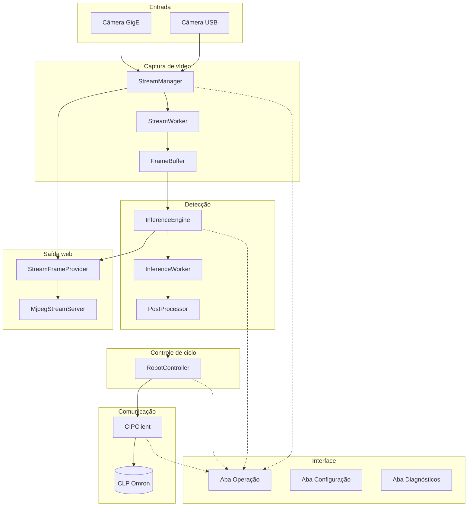
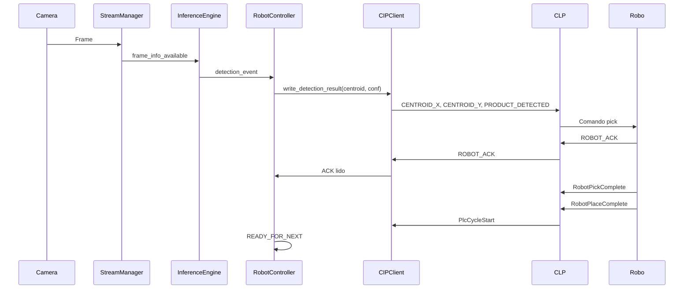
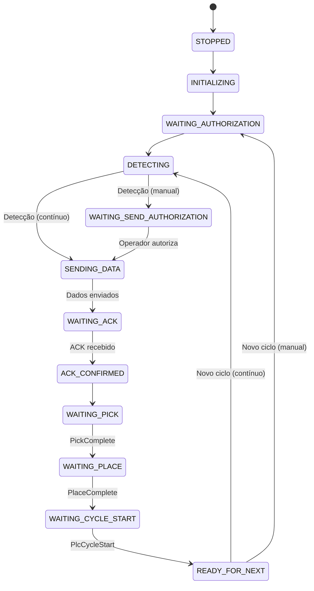

# Realtec Vision Buddmeyer — Documentação para Avaliação (Cliente e TI)

**Documento de referência** para avaliação do sistema por clientes e equipe de TI. Contém visão de alto e baixo nível, casos de uso, features, esquemas gráficos, tutorial de instalação e de uso.

---

**Versão do sistema:** 2.0  
**Data do documento:** 2025  
**Confidencialidade:** Uso do cliente e parceiros do projeto.

---

## Índice

1. [Linguagem de alto nível](#1-linguagem-de-alto-nível)
2. [Linguagem de baixo nível](#2-linguagem-de-baixo-nível)
3. [Casos de uso e interface (UI)](#3-casos-de-uso-e-interface-ui)
4. [Features, funções e variáveis](#4-features-funções-e-variáveis)
5. [Esquemas gráficos](#5-esquemas-gráficos)
6. [Tutorial de instalação (modo clone GitHub)](#6-tutorial-de-instalação-modo-clone-github)
7. [Tutorial de uso e explicações](#7-tutorial-de-uso-e-explicações)

---

# 1. Linguagem de alto nível

## 1.1 O que é o sistema

O **Realtec Vision Buddmeyer** (Buddmeyer Vision System v2.0) é um sistema supervisório para automação industrial do tipo **pick-and-place**:

- **Objetivo:** Detectar embalagens em tempo real, calcular a posição do centroide e enviar coordenadas ao CLP (Controlador Lógico Programável) para que o robô execute a coleta e posicionamento.
- **Contexto:** Linhas de expedição, esteiras, células de picking com robôs articulados ou colaborativos.
- **Benefícios:** Automação da detecção visual, rastreabilidade, integração com CLP Omron via EtherNet-IP.

## 1.2 Fluxo de dados (visão executiva)

```
Câmera (USB ou GigE)
    → Captura de vídeo
    → Detecção de objetos (RT-DETR)
    → Pós-processamento (filtros, confiança)
    → Evento de detecção (centroide, confiança)
    → Controlador de ciclo (máquina de estados)
    → Cliente CIP → CLP Omron (TAGs)
    → Interface (vídeo ao vivo, status, eventos)
```

Opcionalmente, um **stream MJPEG** permite visualizar o vídeo com detecções em um navegador (supervisório remoto), sem instalação extra.

## 1.3 Tecnologias principais

| Camada        | Tecnologia |
|---------------|------------|
| Interface     | PySide6 (Qt) — aplicação desktop Windows |
| Configuração  | YAML + Pydantic — parâmetros persistentes |
| Visão         | PyTorch, RT-DETR — detecção em tempo real |
| Imagem        | OpenCV, NumPy — captura e pré-processamento |
| CLP           | aphyt (CIP/EtherNet-IP) — comunicação com Omron NX102 |
| Logs e métricas | structlog, métricas internas |

## 1.4 Glossário rápido

| Termo | Significado |
|------|-------------|
| **CLP** | Controlador Lógico Programável (Omron NX102) |
| **CIP** | Common Industrial Protocol — protocolo sobre EtherNet-IP |
| **TAG** | Variável lógica no CLP (ex.: CENTROID_X, ROBOT_ACK) |
| **Handshake** | Sequência de sinais entre visão e CLP para sincronizar o ciclo |
| **NMS** | Non-Maximum Suppression — filtro de caixas sobrepostas |
| **mm/px** | Calibração: milímetros por pixel para coordenadas físicas |
| **Centroide** | Centro da caixa de detecção (x, y), posição para o robô |

---

# 2. Linguagem de baixo nível

## 2.1 Estrutura de pastas

| Pasta / arquivo | Conteúdo |
|-----------------|----------|
| `main.py` | Ponto de entrada da aplicação |
| `config/config.yaml` | Configuração persistida |
| `config/settings.py` | Modelos Pydantic e leitura/gravação |
| `streaming/` | Gerenciador de stream, adaptadores USB/GigE, buffer de frames |
| `detection/` | Carregamento do modelo, engine de inferência, pós-processamento |
| `preprocessing/` | Calibração mm/px, ROI, brilho/contraste |
| `communication/` | Cliente CIP, mapeamento de TAGs |
| `control/` | Controlador do robô (máquina de estados) |
| `output/` | Stream MJPEG (provedor de frame + servidor HTTP) |
| `ui/` | Janela principal, abas (Operação, Configuração, Diagnósticos) |

## 2.2 Principais classes e responsabilidades

| Classe / módulo | Responsabilidade |
|-----------------|------------------|
| `StreamManager` | Inicia/para captura, troca de fonte (USB/GigE), expõe frames |
| `USBCameraAdapter` / `GigECameraAdapter` | Abertura e leitura de frames da câmera |
| `InferenceEngine` | Carrega modelo RT-DETR, processa frames, emite eventos de detecção |
| `PostProcessor` | NMS, filtro de confiança, geração de centroides |
| `RobotController` | Estados do ciclo (detecção → envio → ACK → Pick → Place → próximo) |
| `CIPClient` | Conexão com CLP, escrita de resultado, leitura de TAGs |
| `StreamFrameProvider` / `MjpegStreamServer` | Buffer do frame anotado e servidor MJPEG |
| `OperationPage` | Orquestra início/parada, envia centroide ao CLP, atualiza UI |
| `ConfigurationPage` | Carrega/salva parâmetros na interface e em YAML |

## 2.3 Protocolos e interfaces

| Componente | Protocolo / Interface |
|------------|------------------------|
| Câmera USB | OpenCV VideoCapture (V4L2/WDM no Windows) |
| Câmera GigE | OpenCV GStreamer ou backend GigE Vision |
| CLP | CIP sobre EtherNet-IP (porta 44818) |
| Stream web | HTTP MJPEG (porta 8765) |

## 2.4 Singletons (uma instância por processo)

| Classe | Onde |
|--------|------|
| `Settings` | config.settings |
| `StreamManager` | streaming.stream_manager |
| `InferenceEngine` | detection.inference_engine |
| `CIPClient` | communication.cip_client |
| `RobotController` | control.robot_controller |

---

# 3. Casos de uso e interface (UI)

## 3.1 Janela principal

- **Título:** Buddmeyer Vision System v2.0  
- **Tamanho mínimo:** 1280×720  
- **Menus:** Arquivo (Salvar configurações, Sair), Sistema (Iniciar, Parar, Recarregar modelo), Ajuda (Sobre)  
- **Barra de status:** Estado do sistema (Rodando/Parado), FPS, estado do CLP (Conectado/Simulado/Desconectado), data/hora  

## 3.2 Aba Operação

| Elemento | Descrição |
|----------|-----------|
| **Seleção de fonte** | Câmera USB ou Câmera GigE |
| **Botões** | Iniciar (F5), Pausar, Parar (F6) |
| **Área de vídeo** | Imagem ao vivo com overlay de detecções (caixas, centroide, opcionalmente em mm) |
| **Painel lateral** | Status do sistema, stream, inferência, CLP, robô; última detecção; contadores |
| **Console de eventos** | Log em tempo real de ações e erros |
| **Barra de status do ciclo** | Mensagem do estado atual (ex.: "Aguardando detecção") |
| **Controles de ciclo** | Checkbox "Modo Contínuo"; botões "Autorizar envio ao CLP" e "Novo Ciclo" (modo manual) |

## 3.3 Aba Configuração

| Sub-aba | Campos |
|---------|--------|
| **Fonte de Vídeo** | Tipo (USB/GigE), índice USB, IP/porta GigE, tamanho do buffer |
| **Modelo RT-DETR** | Modelo, caminho local, device, confiança mínima, máximo de detecções, FPS de inferência |
| **Pré-processamento** | Calibração mm/px, brilho, contraste, ROI |
| **Controle (CLP)** | IP, porta, timeout, modo simulado, testar conexão, reconexão, heartbeat |
| **Output** | Stream MJPEG (habilitar, porta, FPS), **URL (acesso web)** com botão Copiar |

## 3.4 Aba Diagnósticos

| Sub-aba | Conteúdo |
|---------|----------|
| **Visão Geral** | Cards: FPS stream, FPS inferência, detecções, CLP, ciclos, erros; indicador de saúde |
| **Métricas** | Gráficos: FPS, tempo de inferência, confiança |
| **Logs** | Visualizador de logs com filtros |
| **Sistema** | SO, Python, PyTorch, CUDA, CPU, RAM, GPU |

## 3.5 Casos de uso operacionais

### UC-01: Iniciar o sistema e visualizar detecções

1. Selecionar fonte (Câmera USB ou Câmera GigE).  
2. Clicar em **Iniciar** (ou F5).  
3. O sistema inicia captura, inferência e conexão com o CLP.  
4. O vídeo exibe frames com overlay de detecções; o painel mostra última detecção e contadores.  
5. Se o CLP não for alcançado, o sistema opera em modo simulado.

### UC-02: Ciclo automático (modo contínuo)

1. Com "Modo Contínuo" marcado e sistema em execução, a câmera detecta a embalagem.  
2. As coordenadas (em mm, se calibração configurada) são enviadas ao CLP.  
3. O robô executa ACK → Pick → Place; o CLP sinaliza fim de ciclo.  
4. O sistema fica pronto para a próxima detecção.

### UC-03: Ciclo com autorização (modo manual)

1. Com "Modo Contínuo" desmarcado, ao haver detecção o sistema aguarda "Autorizar envio ao CLP".  
2. O operador clica em **Autorizar envio ao CLP**.  
3. As coordenadas são enviadas ao CLP e o ciclo segue (ACK → Pick → Place).  
4. Ao final do ciclo, o sistema aguarda "Novo Ciclo".  
5. O operador clica em **Novo Ciclo** para liberar o próximo ciclo.

### UC-04: Visualização remota (stream MJPEG)

1. Com o stream MJPEG habilitado (Config → Output) e sistema rodando, copiar a URL exibida em "URL (acesso web)" (botão Copiar).  
2. Abrir no navegador a URL (ex.: `http://<IP_do_PC>:8765/stream`).  
3. O vídeo com detecções é exibido em tempo real.

### UC-05: Configurar calibração mm/px

1. Aba Configuração → Pré-processamento.  
2. Preencher o campo "Calibração mm/px" (ex.: 0,25).  
3. Salvar configurações.  
4. As coordenadas passam a ser exibidas e enviadas ao CLP em mm.

---

# 4. Features, funções e variáveis

## 4.1 Resumo das features

| Feature | Descrição | Configurável em |
|---------|-----------|------------------|
| **Aquisição de vídeo** | Captura via câmera USB ou GigE | Config → Fonte de vídeo |
| **Detecção de objetos** | RT-DETR; confiança mínima e máximo de detecções | Config → Modelo RT-DETR |
| **Calibração mm/px** | Conversão pixel → mm para coordenadas físicas | Config → Pré-processamento |
| **Comunicação CLP** | IP, porta, timeouts, TAGs, modo simulado | Config → Controle (CLP) |
| **Ciclo pick-and-place** | Modo manual ou contínuo; timeouts de ACK/Pick/Place | Config → Controle (CLP) |
| **Stream web (MJPEG)** | Visualização remota com overlay de detecções | Config → Output |
| **Interface** | Três abas: Operação, Configuração, Diagnósticos | — |

## 4.2 Variáveis por feature

### Aquisição de vídeo (Stream)

| Variável | Descrição | Onde |
|----------|-----------|------|
| `source_type` | `usb` ou `gige` | config.yaml → streaming.source_type |
| `usb_camera_index` | 0, 1, … | config.yaml → streaming.usb_camera_index |
| `gige_ip` | Endereço da câmera | config.yaml → streaming.gige_ip |
| `gige_port` | Porta (ex.: 3956) | config.yaml → streaming.gige_port |
| `max_frame_buffer_size` | Tamanho do buffer | config.yaml → streaming.max_frame_buffer_size |

### Detecção

| Variável | Descrição | Onde |
|----------|-----------|------|
| `default_model` | Nome do modelo (ex.: PekingU/rtdetr_r50vd) | config.yaml → detection.default_model |
| `model_path` | Pasta local de pesos | config.yaml → detection.model_path |
| `confidence_threshold` | Limiar 0–1 | config.yaml → detection.confidence_threshold |
| `max_detections` | Máximo de caixas por frame | config.yaml → detection.max_detections |
| `device` | `cpu`, `cuda` ou `auto` | config.yaml → detection.device |
| `inference_fps` | Limite de FPS | config.yaml → detection.inference_fps |

### Comunicação CLP

| Variável | Descrição | Onde |
|----------|-----------|------|
| `cip.ip` | IP do CLP | config.yaml → cip.ip |
| `cip.port` | Porta EtherNet-IP (44818) | config.yaml → cip.port |
| `cip.simulated` | Modo simulado | config.yaml → cip.simulated |
| `tags` | Mapeamento lógico → físico | config.yaml → tags |

### Stream MJPEG

| Variável | Descrição | Onde |
|----------|-----------|------|
| `stream_http_enabled` | Ativa/desativa servidor | config.yaml → output.stream_http_enabled |
| `stream_http_port` | Porta (ex.: 8765) | config.yaml → output.stream_http_port |
| `stream_http_fps` | FPS do stream | config.yaml → output.stream_http_fps |

## 4.3 Funções principais por módulo

| Função/Método | Arquivo | Responsabilidade |
|---------------|---------|------------------|
| `main()` | main.py | Inicializa app, carrega config, exibe janela |
| `get_settings()` | config/settings.py | Retorna singleton de configurações |
| `create_adapter()` | streaming/source_adapters.py | Factory: USB ou GigE |
| `StreamManager.start()` / `stop()` | streaming/stream_manager.py | Inicia/para captura |
| `ModelLoader.load()` | detection/model_loader.py | Carrega RT-DETR |
| `InferenceEngine.process_frame()` | detection/inference_engine.py | Enfileira frame para inferência |
| `PostProcessor.process()` | detection/postprocess.py | NMS, filtro de confiança |
| `CIPClient.connect()` | communication/cip_client.py | Conecta ao CLP |
| `CIPClient.write_detection_result()` | communication/cip_client.py | Escreve centroide nas TAGs |
| `RobotController.process_detection()` | control/robot_controller.py | Recebe detecção, transiciona estados |
| `OperationPage._start_system()` | ui/pages/operation_page.py | Inicia stream, inferência, CIP, robô |
| `VideoWidget.update_frame()` | ui/widgets/video_widget.py | Exibe frame e overlay |

---

# 5. Esquemas gráficos

## 5.1 Arquitetura de componentes



## 5.2 Fluxo do ciclo Pick-and-Place



## 5.3 Máquina de estados do robô



## 5.4 Esquema simplificado (ASCII)

```
┌─────────────┐     ┌──────────────┐     ┌─────────────┐
│  Câmera     │────▶│  Stream      │────▶│  Inferência │
│  USB/GigE   │     │  Manager     │     │  RT-DETR    │
└─────────────┘     └──────────────┘     └──────┬──────┘
                                                 │
                                                 ▼
┌─────────────┐     ┌──────────────┐     ┌─────────────┐
│  CLP Omron  │◀────│  CIP Client  │◀────│  Robot      │
│  NX102      │     │  (TAGs)      │     │  Controller │
└─────────────┘     └──────────────┘     └─────────────┘
                                                 │
                                                 ▼
┌─────────────┐     ┌──────────────┐     ┌─────────────┐
│  Navegador  │◀────│  MJPEG       │◀────│  Frame      │
│  (supervis.)│     │  Server      │     │  Provider   │
└─────────────┘     └──────────────┘     └─────────────┘
```

---

# 6. Tutorial de instalação (modo clone GitHub)

## 6.1 Pré-requisitos

| Requisito | Especificação |
|-----------|---------------|
| Sistema operacional | Windows 10 (build 1903+) ou Windows 11 |
| Python | 3.10 ou superior |
| GPU | NVIDIA com CUDA (opcional; recomendado) |
| RAM | Mínimo 8 GB (recomendado 16 GB) |
| Disco | ~10 GB livres |
| Rede | Conexão com internet para download de dependências |

## 6.2 Passo a passo — Instalação via clone GitHub

### Passo 1: Instalar Git (se ainda não tiver)

1. Baixe o Git em: https://git-scm.com/download/win  
2. Execute o instalador e siga as instruções.  
3. Verifique: abra o **Prompt de Comando** ou **PowerShell** e digite:
   ```bash
   git --version
   ```

### Passo 2: Clonar o repositório

1. Abra o **Prompt de Comando** ou **PowerShell**.  
2. Navegue até o diretório onde deseja instalar (ex.: `C:\`):
   ```bash
   cd C:\
   ```
3. Clone o repositório (substitua a URL pela URL real do seu repositório):
   ```bash
   git clone https://github.com/RicardoGuemba/Vision_Buddmeyer_PySide.git Realtec_Vision_Buddmeyer
   ```
4. Entre na pasta do projeto:
   ```bash
   cd Realtec_Vision_Buddmeyer
   ```

### Passo 3: Criar ambiente virtual Python

```bash
python -m venv venv
venv\Scripts\activate
```

> **Nota:** Se `python` não for reconhecido, use `py -3.10 -m venv venv` ou o caminho completo do Python instalado.

### Passo 4: Instalar dependências

Na raiz do repositório (pasta que contém `realtec_vision_buddmeyer`):

```bash
pip install -r realtec_vision_buddmeyer/requirements.txt
```

Aguarde o download e instalação (pode levar 10–30 minutos, principalmente o PyTorch).

### Passo 5: (Opcional) Suporte a GPU NVIDIA

Para usar CUDA com PyTorch:

```bash
pip install torch torchvision --index-url https://download.pytorch.org/whl/cu118
```

### Passo 6: Executar o sistema

```bash
cd realtec_vision_buddmeyer
python main.py
```

Ou, a partir da raiz:

```bash
python realtec_vision_buddmeyer/main.py
```

### Passo 7: Primeira configuração

Após a primeira execução:

1. **Configuração → Fonte de Vídeo:** escolha Câmera USB ou GigE e informe índice da câmera ou IP/porta.  
2. **Configuração → Controle (CLP):** informe o IP e a porta do CLP Omron; use "Modo simulado" para testes sem CLP.  
3. **Configuração → Output:** habilite o stream MJPEG. A URL de acesso web é exibida — use o botão "Copiar" e abra no navegador.  
4. Salve as configurações e, na aba **Operação**, clique em **Iniciar** para começar.

## 6.3 Atualizar o projeto (após clone)

Para obter as últimas alterações do repositório:

```bash
cd C:\Realtec_Vision_Buddmeyer
git pull origin gige-operando-com-setup
```

(Substitua `gige-operando-com-setup` pelo nome da branch que você usa.)

---

# 7. Tutorial de uso e explicações

## 7.1 Iniciando o sistema

1. Execute o sistema (veja [Tutorial de instalação](#6-tutorial-de-instalação-modo-clone-github)).  
2. Na aba **Operação**, selecione a fonte de vídeo no combo:
   - **Câmera USB** — usa a câmera configurada em Configuração (índice 0, 1, …).
   - **Câmera GigE** — usa IP e porta configurados.
3. Clique em **Iniciar** (ou pressione **F5**).  
4. Aguarde o carregamento do modelo e a conexão com o CLP.  
5. O vídeo ao vivo com detecções aparecerá na área central.

## 7.2 Interpretando a interface

| Elemento | Significado |
|----------|-------------|
| **Barra de status (inferior)** | Sistema: Rodando/Parado; FPS; CLP: Conectado/Simulado/Desconectado |
| **Painel lateral (direita)** | Status do stream, inferência, CLP, robô; última detecção; contadores |
| **Console de eventos** | Mensagens em tempo real (início, parada, detecções, erros) |
| **Status atual (barra)** | Etapa do ciclo (ex.: "Aguardando detecção", "Aguardando ACK") |

## 7.3 Modo manual vs modo contínuo

| Modo | Comportamento |
|------|---------------|
| **Modo Contínuo (checkbox marcado)** | Ao detectar embalagem, o sistema envia automaticamente as coordenadas ao CLP. O ciclo segue sem intervenção. |
| **Modo Manual (checkbox desmarcado)** | Após detecção, o sistema aguarda o operador clicar em **Autorizar envio ao CLP**. Ao final do ciclo, aguarda **Novo Ciclo**. |

## 7.4 Visualização remota (stream web)

1. Em **Configuração → Output**, habilite "Stream MJPEG (Supervisório Web)".  
2. Salve as configurações.  
3. Inicie o sistema na aba Operação.  
4. Em **Configuração → Output**, copie a **URL (acesso web)** (botão Copiar).  
5. Em outro computador ou celular na mesma rede, abra essa URL no navegador.  
6. O vídeo com detecções será exibido em tempo real.

## 7.5 Configurando o CLP

1. Aba **Configuração → Controle (CLP)**.  
2. Preencha **IP do CLP** (ex.: 192.168.1.10) e **Porta CIP** (44818).  
3. Use **Testar Conexão** para verificar se o CLP está acessível.  
4. Para testes sem CLP real, marque **Modo simulado**.

## 7.6 Calibração mm/px

1. Aba **Configuração → Pré-processamento**.  
2. No campo **Calibração mm/px**, informe o valor (ex.: 0,25 = 0,25 mm por pixel).  
3. Salve as configurações.  
4. As coordenadas passam a ser exibidas e enviadas ao CLP em milímetros.

## 7.7 Atalhos de teclado

| Atalho | Ação |
|--------|------|
| F5 | Iniciar sistema |
| F6 | Parar sistema |
| F11 | Tela cheia (toggle) |
| Ctrl+S | Salvar configurações |
| Ctrl+Q | Sair |

## 7.8 Troubleshooting rápido

| Problema | Solução |
|----------|---------|
| Câmera não detectada | Verifique se a câmera está conectada; tente outro índice USB (0, 1, 2). |
| CLP não conecta | Verifique IP/porta; teste conectividade (ping); use modo simulado para testes. |
| Modelo não carrega | Verifique conexão com internet (Hugging Face); ou baixe o modelo manualmente para `models/`. |
| CUDA não detectado | Instale drivers NVIDIA; instale PyTorch com CUDA (veja instalação). |
| Stream web não abre | Verifique se a porta 8765 está liberada no firewall; use o IP correto do PC. |

---

**Fim do documento.** Para detalhes adicionais, consulte:
- [DOCUMENTACAO_PARA_CLIENTE.md](DOCUMENTACAO_PARA_CLIENTE.md) — versão resumida para cliente
- [DOCUMENTACAO_SISTEMA_COMPLETA.md](DOCUMENTACAO_SISTEMA_COMPLETA.md) — documentação técnica completa
- [USO_E_ABAS.md](USO_E_ABAS.md) — guia detalhado das abas
- [TAG_CONTRACT.md](TAG_CONTRACT.md) — contrato de TAGs PC ↔ CLP
