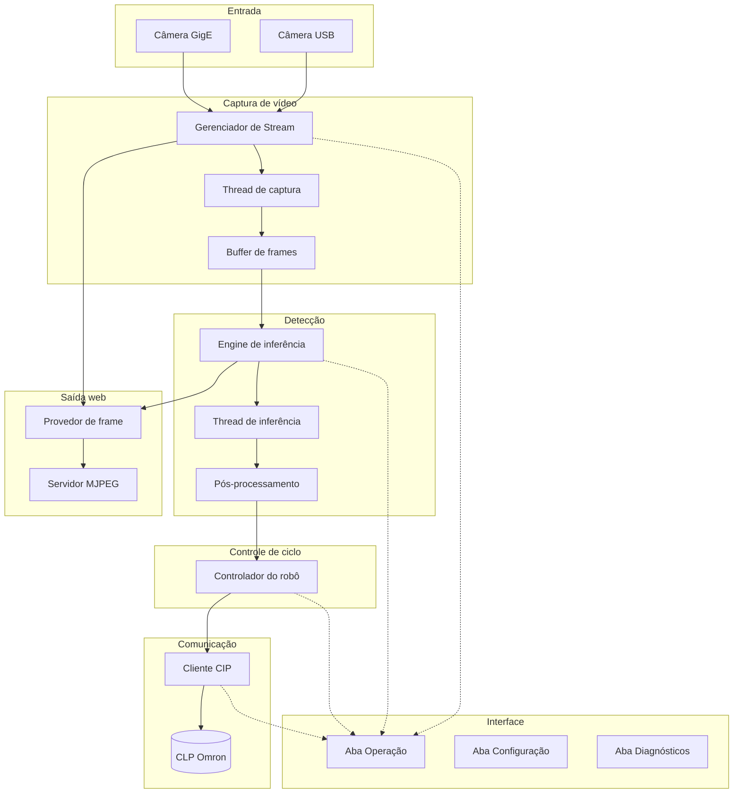

# Buddmeyer Vision System v2.0 — Documentação para o Cliente

**Documento de referência técnico-funcional** — Visão de alto e baixo nível, componentes, variáveis por feature e interface, para compartilhamento com o cliente.

---

**Versão do sistema:** 2.0  
**Data do documento:** 2025  
**Confidencialidade:** Uso do cliente e parceiros do projeto.

---

## Índice

1. [Como instalar o sistema](#1-como-instalar-o-sistema)
2. [Visão geral (alto nível)](#2-visão-geral-alto-nível)
3. [Componentes do sistema](#3-componentes-do-sistema)
4. [Features e variáveis por feature](#4-features-e-variáveis-por-feature)
5. [Documentação de baixo nível (referência)](#5-documentação-de-baixo-nível-referência)
6. [Interface do usuário](#6-interface-do-usuário)
7. [Casos de uso operacionais](#7-casos-de-uso-operacionais)
8. [Glossário](#8-glossário)

---

# 1. Como instalar o sistema

Este tópico descreve como instalar o Buddmeyer Vision na máquina do cliente. Há duas opções: usar o instalador automático (.exe) ou instalar manualmente a partir do código-fonte (clone do repositório).

## 1.1 Requisitos antes de instalar

| Requisito | Especificação |
|-----------|----------------|
| Sistema operacional | Windows 10 (build 1903+) ou Windows 11 |
| Python | 3.10 ou superior (apenas para instalação manual ou para o instalador .exe verificar) |
| GPU | NVIDIA com CUDA (opcional; recomendado para melhor desempenho) |
| RAM | Mínimo 8 GB (recomendado 16 GB) |
| Disco | ~10 GB livres |
| Rede | Conexão com internet para download de dependências (PyTorch, etc.) |

## 1.2 Opção A — Instalador .exe (recomendado para o cliente)

Se você recebeu o arquivo **BuddmeyerVisionInstallerCompleto.exe** (ou similar):

1. **Execute o instalador**  
   Dê duplo clique no arquivo `.exe`.

2. **Siga as instruções na tela**  
   O instalador irá:
   - Verificar se Python 3.10+ está instalado no sistema
   - Criar o diretório de instalação (padrão: `C:\Users\<SeuUsuário>\BuddmeyerVision`)
   - Copiar os arquivos do projeto
   - Criar um ambiente virtual Python e instalar todas as dependências (PySide6, PyTorch, OpenCV, aphyt, etc.)
   - Criar o script **Iniciar_Buddmeyer_Vision.bat**

3. **Aguarde a conclusão**  
   A instalação pode levar de 10 a 30 minutos, dependendo da internet (download do PyTorch e demais pacotes).

4. **Inicie o sistema**  
   - Abra a pasta de instalação (ex.: `C:\Users\<SeuUsuário>\BuddmeyerVision`)
   - Dê duplo clique em **Iniciar_Buddmeyer_Vision.bat**

**Requisitos:** Python 3.10+ instalado e marcado “Add Python to PATH” durante a instalação do Python; conexão com internet; privilégios suficientes para criar pasta e instalar pacotes.

## 1.3 Opção B — Instalação manual (clone do repositório)

Se você tem acesso ao repositório do projeto (clone ou cópia da pasta):

1. **Clone ou copie o projeto**  
   Coloque o projeto em um diretório de sua escolha, por exemplo:
   ```bash
   cd C:\Realtec_Vision_Buddmeyer
   ```
   (Use o caminho real onde o repositório foi clonado.)

2. **Crie um ambiente virtual**  
   ```bash
   python -m venv venv
   venv\Scripts\activate
   ```

3. **Instale as dependências**  
   Na raiz do repositório (pasta que contém `realtec_vision_buddmeyer`):
   ```bash
   pip install -r realtec_vision_buddmeyer/requirements.txt
   ```

4. **(Opcional) Suporte a GPU NVIDIA**  
   Para usar CUDA com PyTorch:
   ```bash
   pip install torch torchvision --index-url https://download.pytorch.org/whl/cu118
   ```

5. **Execute o sistema**  
   ```bash
   cd realtec_vision_buddmeyer
   python main.py
   ```
   Ou, a partir da raiz do repositório:
   ```bash
   python realtec_vision_buddmeyer/main.py
   ```

## 1.4 Primeira configuração

Após a instalação:

- **Configuração → Fonte de Vídeo:** escolha Câmera USB ou GigE e informe índice da câmera ou IP/porta.
- **Configuração → Controle (CLP):** informe o IP e a porta do CLP Omron; use “Modo simulado” para testes sem CLP.
- **Configuração → Output:** habilite o stream MJPEG (protocolo principal, sem instalação extra). A URL de acesso web é exibida na interface — use o botão "Copiar" e abra no navegador.
- Salve as configurações e, na aba **Operação**, clique em **Iniciar** para começar.

---

# 2. Visão geral (alto nível)

## 2.1 Objetivo do sistema

O **Buddmeyer Vision System** é um sistema supervisório para automação industrial do tipo **pick-and-place**:

- **Entrada:** câmeras industriais (USB ou GigE) capturam a cena.
- **Processamento:** modelo de visão (RT-DETR) detecta embalagens em tempo real e calcula a posição do centroide.
- **Saída:** coordenadas (em pixel ou mm) e sinais de confiança são enviados ao CLP (Omron NX102) via protocolo CIP/EtherNet-IP.
- **Ciclo:** o CLP comanda o robô (ACK → Pick → Place); o sistema pode operar em modo **contínuo** (automático) ou **manual** (com autorização do operador).

## 2.2 Fluxo de dados (alto nível)

```
Câmera (USB ou GigE)
    → Captura de vídeo (Stream)
    → Detecção de objetos (RT-DETR)
    → Pós-processamento (filtros, NMS)
    → Evento de detecção (centroide, confiança)
    → Controlador de ciclo (máquina de estados)
    → Cliente CIP → CLP Omron (TAGs)
    → Interface (vídeo ao vivo, status, eventos)
```

Opcionalmente, um **stream MJPEG** permite visualizar o vídeo com detecções em um navegador (supervisório remoto).

## 2.3 Tecnologias principais

| Camada        | Tecnologia / Observação |
|---------------|--------------------------|
| Interface     | PySide6 (Qt) — aplicação desktop Windows |
| Configuração  | YAML + Pydantic — parâmetros persistentes |
| Visão         | PyTorch, RT-DETR — detecção em tempo real |
| Imagem        | OpenCV, NumPy — captura e pré-processamento |
| CLP           | aphyt (CIP/EtherNet-IP) — comunicação com Omron NX102 |
| Logs e métricas | structlog, métricas internas |

---

# 3. Componentes do sistema

## 3.1 Diagrama de componentes



## 3.2 Descrição dos componentes

| Componente | Função |
|------------|--------|
| **Câmera USB / GigE** | Fonte de imagem; suporta câmera USB (índice 0, 1, …) ou câmera GigE (IP + porta). |
| **Gerenciador de Stream** | Controla tipo de fonte, inicia/para a captura, expõe frames para o resto do sistema. |
| **Buffer de frames** | Armazena os últimos N frames em memória (tamanho configurável). |
| **Engine de inferência** | Carrega o modelo RT-DETR e processa frames em thread dedicada. |
| **Pós-processamento** | Aplica NMS, filtro de confiança e gera centroides e eventos de detecção. |
| **Controlador do robô** | Máquina de estados do ciclo pick-and-place (autorização, envio ao CLP, ACK, Pick, Place). |
| **Cliente CIP** | Conexão com o CLP; leitura/escrita de TAGs; modo real ou simulado. |
| **Servidor MJPEG** | Servidor HTTP que entrega stream de vídeo com detecções para navegador. |
| **Aba Operação** | Vídeo ao vivo, controles (Iniciar/Pausar/Parar), seleção de fonte, modo manual/contínuo. |
| **Aba Configuração** | Parâmetros de fonte, modelo, pré-processamento, CLP e saída. |
| **Aba Diagnósticos** | Visão geral, métricas, logs e informações de sistema. |

---

# 4. Features e variáveis por feature

## 4.1 Resumo das features

| Feature | Descrição | Configurável em |
|---------|-----------|------------------|
| **Aquisição de vídeo** | Captura via câmera USB ou GigE | Config → Fonte de vídeo |
| **Detecção de objetos** | RT-DETR; confiança mínima e máximo de detecções | Config → Modelo RT-DETR |
| **Calibração mm/px** | Conversão pixel → mm para coordenadas físicas | Config → Pré-processamento |
| **Comunicação CLP** | IP, porta, timeouts, TAGs, modo simulado | Config → Controle (CLP) |
| **Ciclo pick-and-place** | Modo manual ou contínuo; timeouts de ACK/Pick/Place | Config → Controle (CLP) / robot_control |
| **Stream web (MJPEG)** | Visualização remota com overlay de detecções | Config → Output |
| **Interface** | Três abas: Operação, Configuração, Diagnósticos | — |

## 4.2 Variáveis por feature

### Feature: Aquisição de vídeo (Stream)

| Variável / conceito | Descrição | Onde é definido/uso |
|---------------------|-----------|----------------------|
| Tipo de fonte | `usb` ou `gige` | config.yaml → streaming.source_type; combo na Operação |
| Índice câmera USB | 0, 1, … | config.yaml → streaming.usb_camera_index |
| IP câmera GigE | Endereço da câmera | config.yaml → streaming.gige_ip |
| Porta GigE | Porta de comunicação (ex.: 3956) | config.yaml → streaming.gige_port |
| Tamanho do buffer | Quantidade máxima de frames em memória | config.yaml → streaming.max_frame_buffer_size |
| Estado do stream | Rodando / parado / erro | Interno (StreamManager); exibido na UI |
| FPS atual | Taxa de quadros da captura | Calculado; exibido na barra de status e Diagnósticos |

### Feature: Detecção

| Variável / conceito | Descrição | Onde é definido/uso |
|---------------------|-----------|----------------------|
| Modelo | Nome do modelo (ex.: PekingU/rtdetr_r50vd) | config.yaml → detection.default_model |
| Caminho do modelo | Pasta local de pesos/config | config.yaml → detection.model_path |
| Confiança mínima | Limiar 0–1 para aceitar detecção | config.yaml → detection.confidence_threshold; slider na Config |
| Máximo de detecções | Número máximo de caixas por frame | config.yaml → detection.max_detections |
| Device | `cpu`, `cuda` ou `auto` | config.yaml → detection.device |
| FPS de inferência | Limite de processamento (frames/s) | config.yaml → detection.inference_fps |
| Última detecção | Melhor detecção usada para envio ao CLP | Interno (OperationPage / RobotController) |
| Contador de detecções | Total de detecções na sessão | Exibido no painel de status |

### Feature: Calibração e pré-processamento

| Variável / conceito | Descrição | Onde é definido/uso |
|---------------------|-----------|----------------------|
| mm por pixel | Fator de conversão coordenadas (px → mm) | config.yaml → preprocess.mm_per_pixel; Config → Pré-processamento |
| Brilho / contraste | Ajustes opcionais de imagem | config.yaml → preprocess; sliders na Config |
| ROI | Região de interesse (x, y, largura, altura) | config.yaml → preprocess.roi; Config → Pré-processamento |

### Feature: Comunicação CLP

| Variável / conceito | Descrição | Onde é definido/uso |
|---------------------|-----------|----------------------|
| IP do CLP | Endereço do controlador | config.yaml → cip.ip; Config → Controle (CLP) |
| Porta CIP | Porta EtherNet-IP (ex.: 44818) | config.yaml → cip.port |
| Timeout de conexão | Tempo máximo para conectar (s) | config.yaml → cip.connection_timeout |
| Modo simulado | Simula CLP sem hardware | config.yaml → cip.simulated; checkbox na Config |
| TAGs (exemplos) | CENTROID_X, CENTROID_Y, ROBOT_ACK, etc. | config.yaml → tags; mapeamento lógico → físico no CLP |
| Estado da conexão | Conectado / Desconectado / Simulado | Exibido na barra de status e painel |

### Feature: Ciclo pick-and-place

| Variável / conceito | Descrição | Onde é definido/uso |
|---------------------|-----------|----------------------|
| Modo de ciclo | `manual` ou `continuous` | Checkbox "Modo Contínuo" na Operação |
| Estado do controlador | Ex.: Aguardando detecção, Enviando dados, Aguardando ACK, etc. | Máquina de estados; exibido na barra da Operação |
| Contador de ciclos | Número de ciclos completados | Exibido no painel de status |
| Timeout ACK / Pick / Place | Tempos máximos (s) para cada etapa | config.yaml → robot_control |
| Autorizar envio (manual) | Botão para liberar envio da detecção ao CLP | Aba Operação |
| Novo ciclo (manual) | Botão para liberar próximo ciclo | Aba Operação |

### Feature: Stream MJPEG (supervisório web)

Protocolo principal para visualização remota. **Não requer instalação extra** — apenas Python e OpenCV. A URL de acesso é exibida na interface (Config → Output → URL (acesso web)) e pode ser copiada para abrir no navegador.

| Variável / conceito | Descrição | Onde é definido/uso |
|---------------------|-----------|----------------------|
| Habilitado | Ativa/desativa o servidor MJPEG | config.yaml → output.stream_http_enabled; Config → Output |
| Porta HTTP | Porta do servidor (ex.: 8765) | config.yaml → output.stream_http_port |
| FPS do stream | Limite de quadros enviados pela rede | config.yaml → output.stream_http_fps |
| URL de visualização | Exibida na interface Output; ex.: `http://<IP>:8765/stream` | Config → Output → URL (acesso web); botão Copiar |

---

# 5. Documentação de baixo nível (referência)

Esta seção serve de referência para suporte e evolução do sistema (equipe técnica do cliente ou integrador).

## 5.1 Estrutura de pastas principais

| Pasta / arquivo | Conteúdo |
|-----------------|----------|
| `main.py` | Ponto de entrada da aplicação |
| `config/config.yaml` | Configuração persistida (streaming, detection, cip, tags, etc.) |
| `config/settings.py` | Modelos de configuração (Pydantic) e leitura/gravação |
| `streaming/` | Gerenciador de stream, adaptadores USB/GigE, buffer de frames |
| `detection/` | Carregamento do modelo, engine de inferência, pós-processamento, eventos |
| `preprocessing/` | Calibração mm/px, ROI, brilho/contraste |
| `communication/` | Cliente CIP, mapeamento de TAGs, estado da conexão |
| `control/` | Controlador do robô (máquina de estados) |
| `output/` | Stream MJPEG (provedor de frame + servidor HTTP) |
| `ui/` | Janela principal, abas (Operação, Configuração, Diagnósticos), widgets |

## 5.2 Principais classes e responsabilidades

| Classe / módulo | Responsabilidade |
|-----------------|------------------|
| `StreamManager` | Inicia/para captura, troca de fonte (USB/GigE), expõe frames |
| `USBCameraAdapter` / `GigECameraAdapter` | Abertura e leitura de frames da câmera |
| `InferenceEngine` | Carrega modelo, processa frames, emite eventos de detecção |
| `PostProcessor` | NMS, filtro de confiança, geração de centroides |
| `RobotController` | Estados do ciclo (detecção → envio → ACK → Pick → Place → próximo) |
| `CIPClient` | Conexão com CLP, escrita de resultado de detecção, leitura de TAGs |
| `StreamFrameProvider` / `MjpegStreamServer` | Buffer do frame anotado e servidor MJPEG |
| `OperationPage` | Orquestra início/parada, envia centroide ao CLP, atualiza UI |
| `ConfigurationPage` | Carrega/salva parâmetros na interface e em YAML |

## 5.3 Variáveis globais e singletons (referência)

| Escopo | Nome / tipo | Uso |
|--------|-------------|-----|
| Configuração | Instância única de `Settings` | Configuração em memória; carregada de config.yaml |
| Stream | `StreamManager` (singleton) | Uma instância do gerenciador de captura |
| Detecção | `InferenceEngine` (singleton) | Uma instância da engine de inferência |
| CLP | `CIPClient` (singleton) | Uma instância do cliente CIP |
| Ciclo | `RobotController` (singleton) | Uma instância do controlador do robô |

---

# 6. Interface do usuário

## 6.1 Janela principal

- **Título:** Buddmeyer Vision System v2.0  
- **Tamanho mínimo:** 1280×720  
- **Menus:** Arquivo (Salvar configurações, Sair), Sistema (Iniciar, Parar, Recarregar modelo), Ajuda (Sobre)  
- **Barra de status:** Estado do sistema (Rodando/Parado), FPS, estado do CLP (Conectado/Simulado/Desconectado), data/hora  

## 6.2 Aba Operação

- **Seleção de fonte:** Câmera USB ou Câmera GigE  
- **Botões:** Iniciar (F5), Pausar, Parar (F6)  
- **Área de vídeo:** Imagem ao vivo com overlay de detecções (caixas, centroide, opcionalmente em mm)  
- **Painel lateral:** Status do sistema, stream, inferência, CLP, robô; última detecção; contadores (detecções, ciclos, erros)  
- **Console de eventos:** Log em tempo real de ações e erros  
- **Barra de status do ciclo:** Mensagem do estado atual do controlador (ex.: “Aguardando detecção”)  
- **Controles de ciclo:** Checkbox “Modo Contínuo”; botões “Autorizar envio ao CLP” e “Novo Ciclo” (modo manual)  

## 6.3 Aba Configuração

- **Fonte de vídeo:** Tipo (USB/GigE), índice USB, IP/porta GigE, tamanho do buffer  
- **Modelo RT-DETR:** Modelo, caminho local, device, confiança mínima, máximo de detecções, FPS de inferência  
- **Pré-processamento:** Calibração mm/px, brilho, contraste, ROI  
- **Controle (CLP):** IP, porta, timeout, modo simulado, testar conexão, reconexão, heartbeat  
- **Output:** Stream MJPEG (habilitar, porta, FPS)  
- **Ações:** Restaurar padrões, Salvar configurações  

## 6.4 Aba Diagnósticos

- **Visão geral:** Cards com FPS do stream, FPS da inferência, detecções, CLP, ciclos, erros; indicador de saúde  
- **Métricas:** Gráficos de FPS, tempo de inferência, confiança  
- **Logs:** Visualizador de logs com filtros  
- **Sistema:** Informações de SO, Python, PyTorch, CUDA, CPU, RAM, GPU  

---

# 7. Casos de uso operacionais

## UC-01: Iniciar o sistema e visualizar detecções

1. Selecionar fonte (Câmera USB ou Câmera GigE).  
2. Clicar em **Iniciar** (ou F5).  
3. O sistema inicia captura, inferência e conexão com o CLP.  
4. O vídeo exibe frames com overlay de detecções; o painel mostra última detecção e contadores.  
5. Se o CLP não for alcançado, o sistema pode operar em modo simulado (aviso na interface).  

## UC-02: Ciclo automático (modo contínuo)

1. Com “Modo Contínuo” marcado e sistema em execução, a câmera detecta a embalagem.  
2. As coordenadas (em mm, se calibração configurada) são enviadas ao CLP.  
3. O robô executa ACK → Pick → Place; o CLP sinaliza fim de ciclo.  
4. O sistema fica pronto para a próxima detecção.  

## UC-03: Ciclo com autorização (modo manual)

1. Com “Modo Contínuo” desmarcado, ao haver detecção o sistema aguarda “Autorizar envio ao CLP”.  
2. O operador clica em **Autorizar envio ao CLP**.  
3. As coordenadas são enviadas ao CLP e o ciclo segue (ACK → Pick → Place).  
4. Ao final do ciclo, o sistema aguarda “Novo Ciclo”.  
5. O operador clica em **Novo Ciclo** para liberar o próximo ciclo.  

## UC-04: Visualização remota (stream MJPEG)

1. Com o stream MJPEG habilitado (Config → Output) e sistema rodando, copiar a URL exibida em "URL (acesso web)" ou abrir no navegador `http://<IP_do_PC>:8765/` ou `/viewer`.  
2. Informar a URL do stream (ex.: `http://<IP>:8765/stream`) e conectar.  
3. O vídeo com detecções é exibido em tempo real.  

## UC-05: Configurar calibração mm/px

1. Aba Configuração → Pré-processamento.  
2. Preencher o campo “Calibração mm/px” (ex.: 0,25).  
3. Salvar configurações.  
4. As coordenadas passam a ser exibidas e enviadas ao CLP em mm.  

---

# 8. Glossário

| Termo | Significado |
|-------|-------------|
| **CLP** | Controlador Lógico Programável (no projeto: Omron NX102). |
| **CIP** | Common Industrial Protocol — protocolo sobre EtherNet-IP usado para comunicação com o CLP. |
| **TAG** | Variável lógica no CLP (ex.: CENTROID_X, CENTROID_Y, ROBOT_ACK). |
| **Handshake** | Sequência de sinais entre o sistema de visão e o CLP para sincronizar o ciclo (envio, ACK, Pick, Place). |
| **NMS** | Non-Maximum Suppression — técnica para reduzir caixas sobrepostas na detecção. |
| **mm/px** | Relação milímetros por pixel usada para converter coordenadas da imagem em coordenadas físicas (mm). |
| **Centroide** | Centro da caixa de detecção (x, y), usado como posição para o robô. |
| **RT-DETR** | Modelo de detecção de objetos em tempo real (família DETR). |

---

**Fim do documento.** Para detalhes de implementação e manutenção, consultar a documentação técnica interna (ex.: DOCUMENTACAO_SISTEMA_COMPLETA.md).
